# Retail Supply Chain Analytics

End-to-end retail supply chain analytics project using Excel, SQL Server, Power BI, and PowerPoint to analyze sales performance, profitability, product and regional performance, salesperson performance, customer segments, and discount-related profitability.

---

## 1. Project Overview

This project analyzes retail sales data to evaluate overall business performance and identify the main factors influencing revenue and profitability.

The analysis was developed using a structured workflow:

- Data Documentation
- Data Quality Assessment
- Data Cleaning and Validation
- Excel Pivot Table Analysis
- SQL Server Analysis
- Power BI Dashboard Development
- Business Insights and Recommendations

The project follows a business-oriented analytical approach, starting with understanding the dataset and validating data quality before performing analysis.

---

## 2. Tools

- **Microsoft Excel** — Data validation, cleaning, Pivot Tables, KPI analysis, and exploratory analysis
- **SQL Server / SSMS** — Data analysis and analytical queries
- **Power BI** — Interactive dashboards and visualization
- **PowerPoint** — Presentation of analytical findings and recommendations

---

## 3. Business Problem

The objective of this project is to evaluate retail sales performance and identify the key factors influencing revenue and profitability.

The analysis focuses on:

- Sales and profitability over time
- Product and category performance
- Regional performance
- Salesperson performance
- Customer and customer segment performance
- Discount and profitability relationships
- Product contribution to total sales
- Pareto (80/20) analysis

The project aims to answer business questions such as:

- How are sales and profitability performing overall and over time?
- Which products and categories contribute most to sales and profit?
- Which regions generate the highest sales and profit?
- How does salesperson performance vary across the business?
- How do different discount levels relate to profitability?
- Which customer segments and customers generate the most value?
- Which products contribute most to total sales?
- What does the Pareto (80/20) analysis reveal about sales concentration?

---

## 4. Dataset

### 4.1 Dataset Source

This project uses the **Retail Supply Chain Sales Dataset** from Kaggle.

Dataset source:

[Retail Supply Chain Sales Dataset](https://www.kaggle.com/datasets/shandeep777/retail-supply-chain-sales-dataset?utm_source=chatgpt.com).

### 4.2 Dataset Size

- **Rows:** 9,994
- **Columns:** 23

### 4.3 Data Grain

**One row represents one order line item.**

This distinction is important because a single order can contain multiple products or line items.

Therefore:

- `Row ID` represents an individual order-line record.
- `Order ID` can appear multiple times.
- Order-level metrics such as Total Orders must use distinct `Order ID` values rather than counting rows.

### 4.4 Key Identifiers

- **Row ID** — unique identifier for each order-line record
- **Order ID** — identifier of the customer order; can repeat when an order contains multiple line items
- **Customer ID** — identifier of the customer
- **Product ID** — identifier of the product

### 4.5 Main Data Fields

The dataset contains information across the following business areas:

**Order Information**
- Row ID
- Order ID
- Order Date
- Ship Date
- Ship Mode

**Customer Information**
- Customer ID
- Customer Name
- Segment

**Geographic Information**
- Country
- City
- State
- Postal Code
- Region

**Sales and Product Information**
- Retail Sales People
- Product ID
- Category
- Sub-Category
- Product Name

**Transaction Status**
- Returned

**Financial Metrics**
- Sales
- Discount
- Profit

**Volume**
- Quantity

### 4.6 Data Documentation

Before beginning the analysis, a separate Data Dictionary was prepared to document:

- Column names
- Business meaning
- Data types
- Field categories
- Identifier and metric roles

This documentation was used as a reference during data validation, cleaning, and analysis.

**Data Dictionary:**  
`[Data Dictionary (Word Document)](Data_Dictionary.docx).

---

## 5. Data Quality Assessment & Cleaning

Before performing analytical calculations, the dataset was systematically reviewed to assess data quality and validate whether the records were suitable for business analysis.

The main validation areas were:

- Completeness
- Uniqueness
- Data types
- Categorical consistency
- Numerical validity
- Date validity
- Business logic
- Outliers
- Return-status handling

### 5.1 Completeness Check

The dataset was checked for blank or missing cells.

Excel's **Go To Special → Blanks** functionality was used to check the dataset for blank values.

**Result:** No blank cells were identified in the dataset.

The dataset was also searched for placeholder values such as:

- `N/A`
- `Unknown`
- `-`
- `0`

using exact cell matching.

No such placeholder values requiring treatment as missing data were identified.

---

### 5.2 Duplicate Check

The dataset was reviewed for duplicate records.

`Row ID` was checked for duplicates and no duplicate Row IDs were identified.

Repeated `Order ID` values were also investigated.

Because the dataset has an **order-line grain**, repeated Order IDs are expected when one order contains multiple line items. Therefore, repeated Order IDs were not treated as duplicate records.

This distinction was important for calculating order-level KPIs such as:

**Total Orders = Distinct Count of Order ID**

---

### 5.3 Data Type Validation

Column data types were reviewed and standardized where necessary.

Key data types included:

| Field | Data Type |
|---|---|
| Row ID | General |
| Order ID | General |
| Order Date | Date |
| Ship Date | Date |
| Ship Mode | General |
| Customer ID | General |
| Customer Name | General |
| Segment | General |
| Country | General |
| City | General |
| State | General |
| Postal Code | General |
| Region | General |
| Retail Sales People | General |
| Product ID | General |
| Category | General |
| Sub-Category | General |
| Product Name | General |
| Returned | General |
| Sales | Number |
| Quantity | Number |
| Discount | Number |
| Profit | Number |

`Quantity` was specifically converted from General format to a numeric format with zero decimal places to ensure correct aggregation and calculation in Pivot Tables.

Identifier fields such as `Row ID`, `Order ID`, `Customer ID`, and `Product ID` were retained as identifiers rather than being treated as numerical measures.

---

### 5.4 Categorical Data Validation

Categorical fields were reviewed using Excel functions such as `UNIQUE` and `FILTER`.

The following types of fields were checked:

- Region
- Category
- Sub-Category
- Ship Mode
- Segment
- Returned
- Salesperson
- Other categorical dimensions

No obvious inconsistent categorical values requiring correction were identified.

---

### 5.5 Numerical Validation

Numerical fields were checked against basic business rules.

#### Quantity

Quantity values were checked for zero or negative values.

**Result:** No invalid zero or negative quantities were identified.

#### Discount

Discount values were checked to ensure they remained within the expected range of:

**0 to 1 (0%–100%)**

No values outside this range were identified.

#### Sales and Profit

Sales and Profit values were reviewed for unusual or logically inconsistent values.

Negative Profit values were not automatically treated as errors because negative profit can represent legitimate loss-making transactions.

---

### 5.6 Date Validation

The relationship between `Order Date` and `Ship Date` was validated.

Business rule:

```text
Ship Date >= Order Date
```
All checked records followed this rule.

No records were identified where a product was shipped before the corresponding order date.

---

### 5.7 Business Logic Validation

Additional relationships between fields were checked to determine whether the data behaved logically from a business perspective.

#### Unit Price

A calculated Unit Price was created:

```text
Unit Price = Sales / Quantity
```
Unit prices were reviewed across products and transactions.

Different unit prices for the same product were not automatically treated as errors because prices can vary between transactions due to factors such as discounts, dates, regions, and sales conditions.

#### Profit and Sales

Profit values were reviewed against Sales to identify logically inconsistent records.

No obvious cases were identified where:

- Profit was greater than Sales
- Profit was lower than negative Sales
---
### 5.8 Outlier Investigation

Potential outliers were reviewed by sorting important numerical fields.

The following fields were investigated:

- Sales
- Quantity
- Profit

Large positive and negative Profit values were investigated rather than automatically removed. For example, the lowest observed Profit value was approximately -6,599.98. This record was investigated and had a 70% discount, providing a plausible business explanation for the large loss. Therefore, the record was retained. This follows the principle: An outlier is not automatically an error.

---

### 5.9 Returned Transactions

Transactions marked as returned were reviewed because the dataset contains both transaction amounts and return status.
Returned transactions were not deleted from the raw dataset.
For the main sales-performance analysis, transactions with the non-returned status:
```text
Returned = 'Not'
```
were included.

Returned transactions were excluded from the main sales and profitability calculations to avoid treating returned transactions as retained sales in the primary performance analysis.
The original records were preserved for potential future return-related analysis.

---

### 5.10 Final Data Preparation

After completing the data quality checks:

- Raw data was preserved.
- Invalid or inconsistent values were not artificially removed.
- Quantity was converted to a numeric format.
- Dates were validated.
- Numerical ranges were checked.
- Duplicate Row IDs were checked.
- Repeated Order IDs were interpreted according to the order-line grain.
- Returned transactions were excluded from the main performance analysis using the analysis rule described above.
- The dataset was considered ready for analytical analysis.

---

## 6. Excel Pivot Table Analysis

After completing the data quality assessment and preparation, Excel Pivot Tables were used to analyze sales performance from several business perspectives.

The analysis covered:

1. Overall Performance
2. Time Analysis
3. Product Performance
4. Regional Performance
5. Salesperson Performance
6. Discount & Profitability

---

### 6.1 Overall Performance

The first stage of the analysis focused on the overall performance of the business.

KPI Definitions

Total Sales: Total revenue generated from the included transactions.

Total Profit: Total profit generated from the included transactions.

Total Quantity: Total number of units sold.

Total Orders: Distinct number of orders based on Order ID.

Average Order Value (AOV)
```text
AOV = Total Sales / Total Orders
```
Overall Profit Margin
```text
Profit Margin = Total Profit / Total Sales
```
The overall Profit Margin was calculated from aggregated Profit and Sales rather than taking the simple average of row-level profit margins.
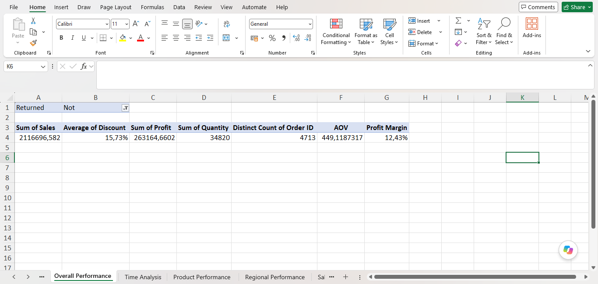

---

### 6.2 Time Analysis

The time analysis examined how sales performance changed over time.

The existing Calendar Table was used to support time-based analysis.

The analysis included:

- Sales by year
- Sales by month
- Profit by month
- Quantity by month
- Orders by month
- Month-over-Month (MoM) Sales Growth
- Best-performing month
- Lowest-performing month
- Year-over-Year (YoY) Sales Growth

MoM analysis was used to understand short-term changes in sales performance.
The analysis also identified November as the highest-sales month and February as the lowest-sales month within the analyzed period.
  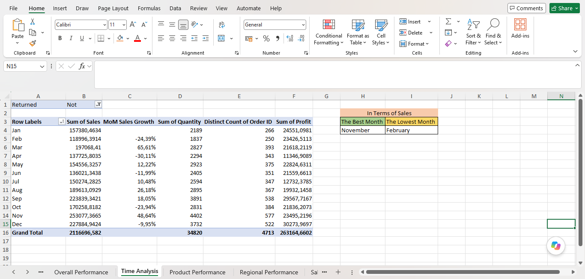
  
---

### 6.3 Product Performance

Product analysis was performed at multiple levels:

Category
Sub-Category
Product

The analysis examined:

Total Sales
Total Profit
Profit Margin
Quantity

This allowed products and product groups to be evaluated not only by revenue generation but also by profitability.

The analysis also helps identify:

- High-sales categories
- High-profit categories
- Loss-making sub-categories
- Top products by Sales
- Top products by Profit
- Products with high Profit Margin
- Products contributing significantly to total Sales
 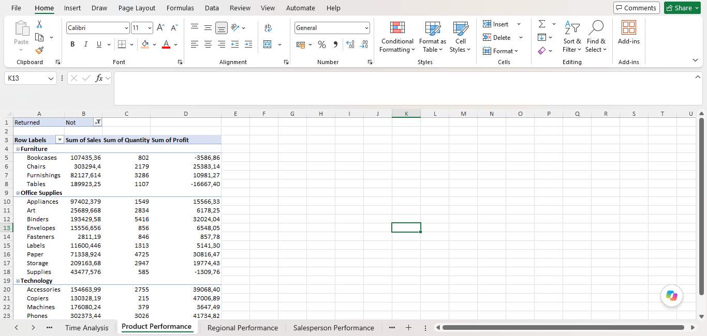

---

### 6.4 Regional Performance

Regional analysis was performed to compare business performance across geographic dimensions.

The analysis included:

- Region
- State

The following metrics were evaluated:

- Total Sales
- Total Profit
- Quantity
- Orders

The analysis was used to identify differences between geographic markets and to distinguish high-performing and lower-performing areas.
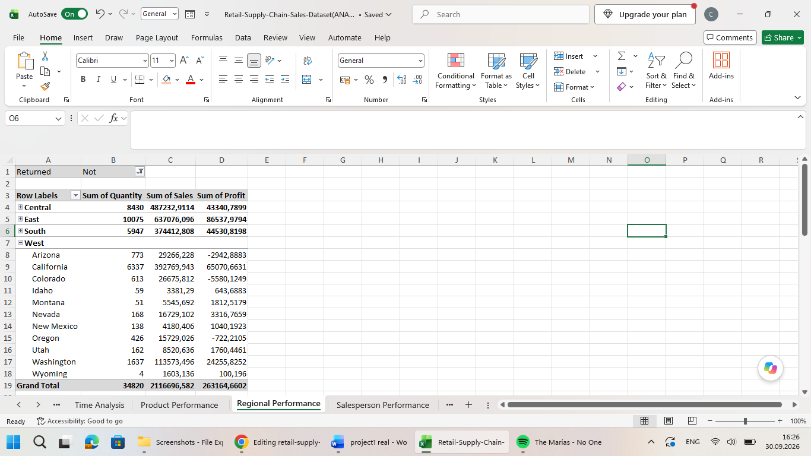

---

### 6.5 Salesperson Performance

Salesperson performance was analyzed using the Retail Sales People field.

The analysis included:

- Total Sales
- Total Profit
- Distinct Orders
  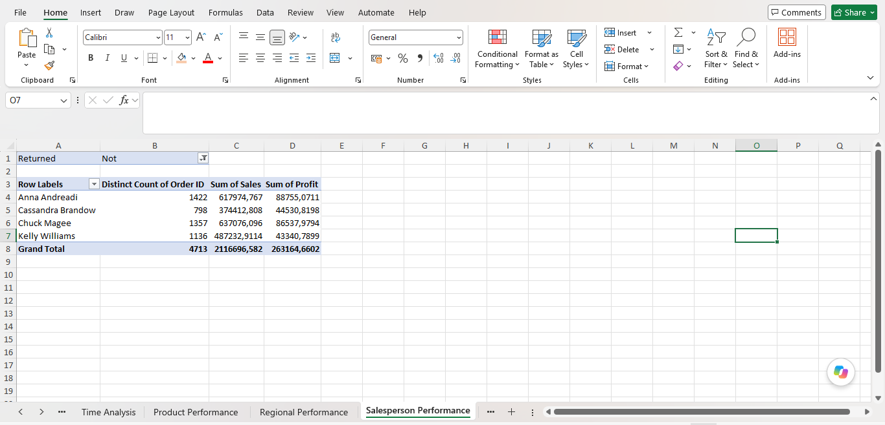
---

### 6.6 Discount & Profitability Analysis

Discount levels were analyzed to understand their relationship with sales and profitability.

A Pivot Table was created with:

Rows: Discount
Values: Sum of Profit, Distinct Order Count, Sum of Sales, Profit Margin
Filter: Returned = Not


The analysis showed that average profitability generally declined at higher discount levels, with average Profit becoming negative at higher discount tiers.

However, the relationship was not perfectly linear. For example, the 10% discount level had a higher average Profit than the 0% discount level.

Therefore, the analysis identifies an association between discount levels and profitability rather than establishing that discount alone causes the change in profitability.

  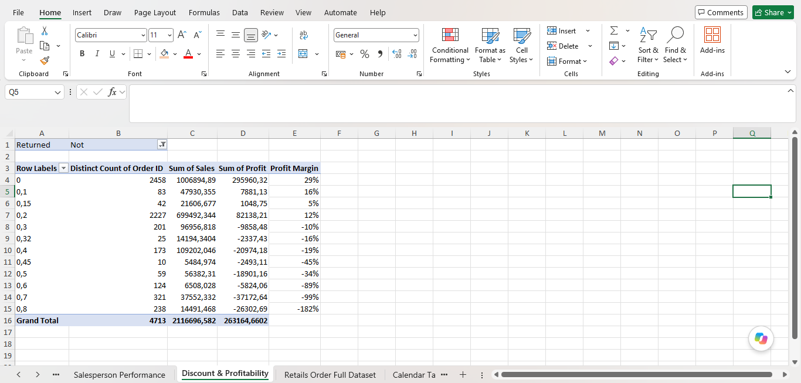

---

## 7. Excel Analysis Summary

The Excel analysis established the main performance picture of the business before moving to SQL-based analysis.

The analysis covered:

Overall business KPIs
Sales and profitability trends over time
Product and category performance
Regional performance
Salesperson performance
Discount and profitability


The Excel analysis also established the key business metrics and analytical questions that were subsequently reproduced and extended using SQL Server.

📂 **File Path:** [`Excel/Retail-Supply-Chain-Sales-Dataset(ANALYSIS).xlsx`](Excel/Retail-Supply-Chain-Sales-Dataset(ANALYSIS).xlsx)

---

## 8. SQL Analysis

The validated dataset was subsequently imported into SQL Server for analytical querying.

The SQL analysis reproduces and extends the business questions explored during the Excel stage using SQL Server queries.

---

### 8.1 Overall Sales Performance

The first stage of the SQL analysis focuses on the overall sales performance of the company.

The following seven business questions were analyzed using SQL Server:

1. Total Sales
2. Total Orders
3. Total Quantity
4. Average Order Value (AOV)
5. Total Profit
6. Overall Profit Margin
7. Average Discount

All calculations in this section exclude returned transactions unless otherwise specified.

---

#### Question 1: What is the Total Sales of the company, excluding returned transactions?

```sql
select sum(sales) as [Total Sales]
from [Retail-Supply-Chain-Sales-Dataset]
where Returned='not'
```
Result: Total Sales: $2,116,696.77

#### Question 2: What is the Total Order Count of the company, excluding returned transactions?

```sql
select count(distinct Order_ID) as [Total Order]
from [Retail-Supply-Chain-Sales-Dataset]
where Returned='not'
```
Result: Total Orders: 4,713

#### Question 3: What is the Total Quantity of the company, excluding returned transactions?

```sql
select sum(quantity) as [Total Quantity]
from [Retail-Supply-Chain-Sales-Dataset]
where Returned='not'
```
Result: Total Quantity: 34,820 units

#### Question 4: What is the AOV of the company?

```sql
select cast(round(sum(Sales) /count(distinct Order_ID), 2, 0)as decimal(10,2)) as AOV
from [Retail-Supply-Chain-Sales-Dataset]
where Returned='not'
```
Result: Average Order Value (AOV): $449.12

#### Question 5: What is the Total Profit of the company?

```sql
select sum(profit) as [Total Profit]
from [Retail-Supply-Chain-Sales-Dataset]
where Returned='not'
```
Result: Total Profit: $263,164.66

#### Question 6: What is the Overall Profit Margin of the company?

```sql
select cast(sum(profit)/sum(sales)*100 as decimal(10,2)) as [Overal Profit Margin]
from [Retail-Supply-Chain-Sales-Dataset]
where Returned='not'
```
Result: Overall Profit Margin: 12.43%

#### Question 7: What is the Average Discount of the company?

```sql
select cast(avg(discount)*100 as decimal(10,2)) as [Average Discount]
from [Retail-Supply-Chain-Sales-Dataset]
where Returned='not'
```
Result: Average Discount: 15.73%

#### Question 8: What were the total sales for each year, excluding returned transactions?

```sql
select C.Year,sum (sales ) as [Total Sales]
from [Retail-Supply-Chain-Sales-Dataset] as RS
inner join Calendar as C
on C.Date=RS.Order_Date
where Returned='Not'
group by c.Year
order by C.year
```
Finding: Sales declined by 5.31% in 2015 compared with 2014, followed by strong growth in 2016 and 2017. The highest annual sales were recorded in 2017 at $657,713.12.

#### Question 9: What was the monthly sales trend across the analyzed period, excluding returned transactions?
```sql
select c.[Month Name],
sum (sales ) as [Total Sales]
from [Retail-Supply-Chain-Sales-Dataset] as RS
inner join Calendar as C
on C.Date=RS.Order_Date
where Returned='Not'
group by c.[Month Name],c.Month
order by c.Month
```
Finding: Monthly sales varied considerably across the year. November recorded the highest total sales at $253,077.36, while February recorded the lowest at $118,996.39.

#### Question 10: What was the monthly breakdown of total profit across the analyzed period, excluding returned transactions?

```sql
 select c.[Month Name],
sum (Profit) as [Total Profit]
from [Retail-Supply-Chain-Sales-Dataset] as RS
inner join Calendar as C
on C.Date=RS.Order_Date
where Returned='Not'
group by c.[Month Name],c.Month
order by c.Month
```
Finding: Monthly profit was highest in December at $30,274.05, followed by September at $29,567.89. April recorded the lowest monthly profit at $11,347.05. <br>
Additional Insight: The month with the highest sales was not the month with the highest profit, indicating that higher sales volume does not necessarily translate into the highest profitability

#### Question 11: What was the monthly breakdown of total orders and units sold, excluding returned transactions?

```sql
select c.[Month Name],
count(distinct order_id) as [Order Count],
sum (Quantity) as [Total Quantity]
from [Retail-Supply-Chain-Sales-Dataset] as RS
inner join Calendar as C
on C.Date=RS.Order_Date
where Returned='Not'
group by c.[Month Name],c.Month
order by c.Month
```
Finding: November had the highest number of orders (577) and units sold (4,402), while February had the lowest number of orders (250) and units sold (1,837).

#### Question 12: What was the Month-over-Month (MoM) sales growth rate, excluding returned transactions?

```sql
WITH Monthly_Sales_CTE AS (
SELECT 
C.Year,
C.Month,
C.[Month Name],
SUM(RS.Sales) AS MonthlySales
FROM [Retail-Supply-Chain-Sales-Dataset] AS RS
INNER JOIN Calendar AS C
ON C.Date = RS.Order_Date
WHERE RS.Returned = 'Not'
GROUP BY C.Year, C.Month, C.[Month Name]
)

SELECT 
Year,
Month,
[Month Name],
MonthlySales,
LAG(MonthlySales) OVER (ORDER BY Year, Month) AS PrevMonthSales,
    round(((MonthlySales - LAG(MonthlySales) OVER (ORDER BY Year, Month)) * 100.0) 
        / LAG(MonthlySales) OVER (ORDER BY Year, Month), 2) AS [MoM Sales Growth %]
FROM Monthly_Sales_CTE
ORDER BY Year, Month
```
Finding: Monthly sales growth was volatile throughout the analyzed period, with both substantial increases and decreases from month to month. November showed strong month-over-month growth in each year, particularly in 2014 (+88.53%) and 2015 (+80.54%).

#### Question 13: Which month had the highest total sales across the analyzed period, excluding returned transactions?

```sql
select top 1
c.[Month Name],
sum (Sales) as [Total Sales]
from [Retail-Supply-Chain-Sales-Dataset] as RS
inner join Calendar as C
on C.Date=RS.Order_Date
where Returned='Not'
group by c.[Month Name]
order by [Total Sales] desc
```
Result: November — $253,077.36

#### Question 14: Which month had the lowest total sales across the analyzed period, excluding returned transactions?

```sql
select top 1
c.[Month Name],
sum (Sales) as [Total Sales]
from [Retail-Supply-Chain-Sales-Dataset] as RS
inner join Calendar as C
on C.Date=RS.Order_Date
where Returned='Not'
group by c.[Month Name]
order by [Total Sales]
```
Result: February — $118,996.39

#### Question 15: What was the Year-over-Year (YoY) sales growth rate, excluding returned transactions?

```sql
WITH Annual_Sales_CTE AS (
SELECT 
C.Year,
SUM(RS.Sales) AS Annual_Sales
FROM [Retail-Supply-Chain-Sales-Dataset] AS RS
INNER JOIN Calendar AS C
ON C.Date = RS.Order_Date
WHERE RS.Returned = 'Not'
GROUP BY C.Year
)
SELECT 
Year,
Annual_Sales,
LAG(Annual_Sales) OVER (ORDER BY Year) AS PrevYearSales,
ROUND(((Annual_Sales - LAG(Annual_Sales) OVER (ORDER BY Year)) * 100.0) 
/ LAG(Annual_Sales) OVER (ORDER BY Year), 2) AS [YoY Sales Growth %]
FROM Annual_Sales_CTE
ORDER BY Year ASC
```
Finding: Sales declined by 5.31% in 2015, followed by strong growth of 33.01% in 2016 and a further 14.77% increase in 2017. Overall, annual sales reached their highest level in 2017.

Time Analysis Summary

-- Annual sales declined by 5.31% in 2015 but increased by 33.01% in 2016 and 14.77% in 2017. <br>
-- November generated the highest total sales, orders, and units sold across the analyzed period. <br>
-- February recorded the lowest total sales, orders, and units sold. <br>
-- December generated the highest total profit, despite November having the highest sales. <br>
-- Monthly sales growth was volatile, with both significant increases and decreases across different months.<br>

---

### 8.1 Product Performance

#### Question 16: Which product categories generated the highest total sales, excluding returned transactions?

```sql
select category,sum(sales) as [Total Sales]
from [Retail-Supply-Chain-Sales-Dataset]
where Returned='not'
group by Category
order by [Total Sales] desc
```
Finding: Technology generated the highest total sales at $763,445.93, followed by Furniture at $682,780.77 and Office Supplies at $670,470.07.

#### Question 17: Which product categories generated the highest total profit, excluding returned transactions?

```sql
select category,sum(Profit) as [Total Profit]
from [Retail-Supply-Chain-Sales-Dataset]
where Returned='not'
group by Category
order by [Total Profit] desc
```
Finding: Technology generated the highest total profit at $131,458.28, while Furniture generated only $16,110.09 despite being the second-highest category by sales.

#### Question 18: Which product categories had the highest profit margins, excluding returned transactions?

```sql
select category,cast(sum(profit)/sum(sales)*100 as decimal(10,2)) as [Total Margin]
from [Retail-Supply-Chain-Sales-Dataset]
where Returned='not'
group by Category
order by [Total Margin] desc
```

Finding: Office Supplies had the highest profit margin at 17.24%, closely followed by Technology at 17.22%. Furniture had a substantially lower profit margin of 2.36%.

Additional Insight: Although Furniture ranked second in total sales, its 2.36% profit margin was substantially lower than the other categories, indicating weaker profitability relative to its sales volume.

#### Question 19: What were the total sales and profit for each product sub-category, excluding returned transactions?

```sql
select Sub_Category,sum(sales) as [Total Sales],
sum(profit) as [Total Profit]
from [Retail-Supply-Chain-Sales-Dataset]
where Returned='not'
group by Sub_Category
```

Finding: Phones and Chairs generated the highest sales among sub-categories, with $302,373.47 and $303,294.41 respectively. However, Copiers generated the highest profit at $47,006.97 despite having substantially lower sales than Phones and Chairs.

Additional Insight: Tables generated $189,923.39 in sales but resulted in a loss of $16,667.54, making it the largest loss-making sub-category.

#### Question 20: Which products generated the highest total sales, excluding returned transactions?

```sql
select Product_Name,sum(sales) as [Total Sales]
from [Retail-Supply-Chain-Sales-Dataset]
where Returned='not'
group by Product_Name
order by [Total Sales] desc
```
Finding: The Canon imageCLASS 2200 Advanced Copier was the top-selling product, generating $47,599.87 in total sales, followed by the Fellowes PB500 Electric Punch Plastic Comb Binding Machine with $27,453.38.

#### Question 21: Which products generated the highest total profit, excluding returned transactions?

```sql
select Product_Name,sum(profit) as [Total Profit]
from [Retail-Supply-Chain-Sales-Dataset]
where Returned='not'
group by Product_Name
order by [Total Profit] desc
```
Finding: The Canon imageCLASS 2200 Advanced Copier also generated the highest total profit at $18,479.96, followed by the Fellowes PB500 Electric Punch Plastic Comb Binding Machine at $7,753.06.

#### Question 22: Which products had the highest profit margins, excluding returned transactions?

```sql
select Product_Name,cast(sum(profit)/sum(sales) * 100 as decimal(10,2))
as [Profit Margin] 
from [Retail-Supply-Chain-Sales-Dataset]
where Returned='not'
group by Product_Name
order by [Profit Margin] desc
```
Finding: Several products achieved very high profit margins, with the highest observed margin reaching 50.00%.

Additional Insight: High profit margins do not necessarily indicate high business contribution, as margin does not account for the absolute sales or profit generated by each product.

#### Question 23: What percentage of total company sales was contributed by each product, excluding returned transactions?

```sql
SELECT 
Product_Name,
SUM(Sales) AS Product_Sales,
SUM(SUM(Sales)) OVER () AS Total_Company_Sales,
ROUND((SUM(Sales) * 100.0) / SUM(SUM(Sales)) OVER (), 2) AS [Sales Contribution %]
FROM [Retail-Supply-Chain-Sales-Dataset]
WHERE Returned = 'Not'
GROUP BY Product_Name
ORDER BY [Sales Contribution %] DESC
```
Finding: The Canon imageCLASS 2200 Advanced Copier was the largest individual contributor to total company sales, accounting for 2.25% of total sales. The top-selling products individually contributed relatively small shares of overall company sales.

**Product Performance Summary**
- Technology generated the highest total sales and profit among the three product categories.
- Furniture ranked second in sales but had a substantially lower profit margin of 2.36%.
- Office Supplies achieved the highest category-level profit margin at 17.24%.
- Phones and Chairs were among the highest-selling sub-categories, while Copiers generated the highest profit among sub-categories.
- Tables generated significant sales but resulted in the largest sub-category loss of $16,667.54.
- The Canon imageCLASS 2200 Advanced Copier was the top product by both sales and total profit.
- The highest-margin products did not necessarily represent the largest sales contributors, highlighting the difference between profitability rate and business contribution.

 ---

 ### 8.4 Regional Performance

#### Question 24: Which regions generated the highest total sales, excluding returned transactions?

```sql
select region,sum(sales) as [Total Sales]
from [Retail-Supply-Chain-Sales-Dataset]
where returned='not'
group by Region
order by [Total Sales] desc
```

Finding: East generated the highest total sales at $637,076.24, followed closely by West at $617,974.87.

#### Question 25: Which regions generated the highest total profit, excluding returned transactions?

```sql
select region,sum(Profit) as [Total Profit]
from [Retail-Supply-Chain-Sales-Dataset]
where returned='not'
group by Region
order by [Total Profit] desc
```
Finding: West generated the highest total profit at $88,755.36, followed by East at $86,538.06.

#### Question 26: Which regions had the highest profit margins, excluding returned transactions?

```sql
select region,cast(sum(profit)/sum(sales)*100 as decimal(10,2)) as [Profit Margin]
from [Retail-Supply-Chain-Sales-Dataset]
where returned='not'
group by Region
order by [Profit Margin] desc
```

Finding: West had the highest profit margin at 14.36%, while Central had the lowest at 8.90%.

#### Question 27: What were the total orders and units sold in each region, excluding returned transactions?

```sql
select region, count(distinct order_id) as [Total Order],
sum(quantity) as [Total Quantity]
from [Retail-Supply-Chain-Sales-Dataset]
where returned='not'
group by Region
```

Finding: West had the highest number of orders (1,422) and units sold (10,368), while South had the lowest number of orders (798) and units sold (5,947).

#### Question 28: What percentage of total company sales did each region contribute, excluding returned transactions?

```sql
select region,
sum(sales) as [Regional Sales],
sum(sum(sales)) over() as [Total Company Sales],
round((sum(sales)*100.0)/ sum(sum(sales)) over(), 2) as [Sales Contribution %]
from [Retail-Supply-Chain-Sales-Dataset]
where Returned='not'
group by region
```

Finding: East contributed the largest share of total company sales at 30.10%, followed by West at 29.20%. Together, these two regions accounted for 59.30% of total sales.

#### Question 29: What was the Month-over-Month (MoM) sales growth rate for each region, excluding returned transactions?

```sql
WITH RegionalAnaliz AS (
SELECT 
RS.Region,
C.Year,
C.Month,
C.[Month Name],
SUM(RS.Sales) AS Total_Sales
FROM [Retail-Supply-Chain-Sales-Dataset] AS RS
INNER JOIN Calendar AS C
ON C.Date = RS.Order_Date
WHERE RS.Returned = 'Not'
GROUP BY RS.Region, C.Year, C.Month, C.[Month Name]
)
SELECT 
Region,
Year,
Month,
[Month Name],
Total_Sales,
LAG(Total_Sales) OVER (PARTITION BY Region ORDER BY Year, Month) AS Prev_Month_Sales,
ROUND(((Total_Sales - LAG(Total_Sales) OVER (PARTITION BY Region ORDER BY Year, Month)) * 100.0) 
/ LAG(Total_Sales) OVER (PARTITION BY Region ORDER BY Year, Month), 2) AS [Regional MoM Sales Growth %]
FROM RegionalAnaliz
ORDER BY Region, Year, Month
```

Finding: Monthly sales growth varied substantially across all regions, with frequent sharp increases and decreases from one month to the next. The South region showed the largest observed MoM increase at 950.54%, while all regions experienced significant month-to-month fluctuations.

Additional Insight: Extreme MoM growth rates should be interpreted alongside absolute sales values, as large percentage changes can result from relatively low sales in the previous month.

**Regional Performance Summary**

- East was the largest region by total sales, while West generated the highest total profit and profit margin.
- West also recorded the highest number of orders and units sold.
- East and West together contributed 59.30% of total company sales.
- Central had the lowest regional profit margin at 8.90%, despite generating $487,232.89 in sales.
- Monthly sales were highly volatile across all regions, with substantial MoM increases and decreases.

---

### 8.5 Salesperson Performance

#### Question 30: Which salespeople generated the highest total sales, excluding returned transactions?

```sql
select Retail_Sales_People,sum(sales) as [Total Sales]
from [Retail-Supply-Chain-Sales-Dataset]
where returned='not'
group by Retail_Sales_People
order by [Total Sales] desc
```

Finding: Chuck Magee generated the highest total sales at $637,076.24, followed by Anna Andreadi at $617,974.87.

#### Question 31: Which salespeople generated the highest total profit, excluding returned transactions?

```sql
select Retail_Sales_People,sum(Profit) as [Total Profit]
from [Retail-Supply-Chain-Sales-Dataset]
where returned='not'
group by Retail_Sales_People
order by [Total Profit] desc
```

Finding: Anna Andreadi generated the highest total profit at $88,755.36, followed by Chuck Magee at $86,538.06.

#### Question 32: Which salespeople had the highest profit margins, excluding returned transactions?

```sql
select Retail_Sales_People,cast(sum(profit)/sum(sales)*100 as decimal(10,2)) as [Profit Margin]
from [Retail-Supply-Chain-Sales-Dataset]
where returned='not'
group by Retail_Sales_People
order by [Profit Margin] desc
```

Finding: Anna Andreadi had the highest profit margin at 14.36%, while Kelly Williams had the lowest at 8.90%.

#### Question 33: How many total orders did each salesperson handle, excluding returned transactions?

```sql
select Retail_Sales_People, count(distinct order_id) as [Total Order]
from [Retail-Supply-Chain-Sales-Dataset]
where returned='not'
group by Retail_Sales_People
order by [Total Order]desc
```

Finding: Anna Andreadi handled the highest number of orders with 1,422, while Cassandra Brandow handled the fewest with 798.

#### Question 34: What was the Average Order Value (AOV) for each salesperson, excluding returned transactions?

```sql
select Retail_Sales_People,cast(round(sum(sales)/count(distinct order_id), 2, 1) as decimal(10,2)) as AOV
from [Retail-Supply-Chain-Sales-Dataset]
where Returned='not'
group by Retail_Sales_People
order by AOV desc
```

Finding: Chuck Magee had the highest Average Order Value (AOV) at $469.47, closely followed by Cassandra Brandow at $469.18.

**Salesperson Performance Summary**

- Chuck Magee generated the highest total sales at $637,076.24 and had the highest AOV at $469.47.
- Anna Andreadi generated the highest total profit at $88,755.36, achieved the highest profit margin at 14.36%, and handled the highest number of orders with 1,422.
- Cassandra Brandow had the second-highest AOV at $469.18 despite generating the lowest total sales and handling the fewest orders.
- Kelly Williams had the lowest profit margin at 8.90% and the lowest AOV at $428.90.

---

### 8.6 Discount & Profitability

#### Question 35: What was the average discount across all non-returned transactions?

```sql
select cast(avg(discount)*100 as decimal(10,2))
from [Retail-Supply-Chain-Sales-Dataset]
where Returned='Not'
```

Finding: The average discount across all non-returned transactions was 15.73%.

#### Question 36: How did Average Profit vary across different Discount levels, excluding returned transactions?

```sql
select Discount,cast(round(avg(profit), 2) as decimal(10,2)) as [Average Profit]
from [Retail-Supply-Chain-Sales-Dataset]
where Returned='not'
group by discount
order by Discount
```

Finding: Average Profit was positive at discount levels up to 20%, but became negative at discount levels of 30% and above. The lowest Average Profit was observed at a 50% discount, at -$309.86.

#### Question 37: How did Average Profit Margin (%) vary across different Discount levels, excluding returned transactions?

```sql
select Discount,cast(round(avg((Profit/sales)*100.0), 2) as decimal(10,2)) as  [Average Profit Margin]
from [Retail-Supply-Chain-Sales-Dataset]
where Returned='not'
group by discount
order by Discount
```

Finding: Average Profit Margin generally declined as discount levels increased. Profit Margin became negative at discount levels of 30% and above and reached -183.27% at an 80% discount.

#### Question 38: What pattern is observed between Average Discount, Total Profit, and Average Profit across product Categories, excluding returned transactions?

```sql
select Category,
cast(round(avg(discount)*100.0, 2) as decimal(10,2)) as [Average Discount],
cast(round(sum(profit), 2) as decimal(10,2)) as [Total Profit],
cast(round(avg(profit), 2) as decimal(10,2)) as [Average Profit]
from [Retail-Supply-Chain-Sales-Dataset]
where returned='not'
group by Category
order by [Average Discount]
```

Finding: Technology had the lowest average discount at 13.07% and generated the highest total profit at $131,458.28. Furniture had the highest average discount at 17.71% and the lowest total profit at $16,110.09.

#### Question 39: What pattern is observed between Average Discount, Total Profit, and Average Profit across Regions, excluding returned transactions?

```sql
select Region,
cast(round(avg(discount)*100.0, 2) as decimal(10,2)) as [Average Discount],
cast(round(sum(profit), 2) as decimal(10,2)) as [Total Profit],
cast(round(avg(profit), 2) as decimal(10,2)) as [Average Profit]
from [Retail-Supply-Chain-Sales-Dataset]
where returned='not'
group by Region
order by [Average Discount]
```

Finding: West had the lowest average discount at 10.90% and generated the highest total profit at $88,755.36. Central had the highest average discount at 23.79% and the lowest average profit at $19.43.

Additional Insight: East and South had the same average discount of 14.59%, but different profit levels, indicating that discount level alone does not fully explain profitability differences across regions.

#### Question 40: Which products have high discount rates and negative total profit, excluding returned transactions?

```sql
select Product_Name,
cast(round(avg(discount)*100.0, 2) as decimal(10,2)) as [Average Discount],
cast(round(sum(profit), 2) as decimal(10,2)) as [Total Profit],
cast(round(avg(profit), 2) as decimal(10,2)) as [Average Profit]
from [Retail-Supply-Chain-Sales-Dataset]
where returned='not'
group by Product_Name
having sum(profit)<0
order by [Average Discount] desc
```
Finding: Several products combined high discount rates with negative total profit. The highest discount level observed was 80%, while the largest total loss among the first 10 products was -$506.46 for the Lexmark MarkNet N8150 Wireless Print Server at a 70% average discount.

**Discount & Profitability Summary**

- The average discount across non-returned transactions was 15.73.
- Average Profit was positive at discount levels up to 20% but became negative at 30% and above.
- Average Profit Margin generally declined as discount levels increased, reaching -183.27% at an 80% discount.
- Technology had the lowest average discount among the three categories and generated the highest total profit, while Furniture had the highest average discount and substantially lower total profit.
- West had the lowest average discount among the regions and generated the highest total profit, while Central had the highest average discount and the lowest average profit.
- Several products combined high discount rates with negative total profit, highlighting products that may require further profitability investigation.

---

### 8.7 Customer Analysis

#### Question 41: What were the total sales for each Customer Segment, excluding returned transactions?

```sql
select Segment,sum(sales) as [Total Sales]
from [Retail-Supply-Chain-Sales-Dataset]
where Returned='not'
group by Segment
order by [Total Sales] desc
```

Finding: The Consumer segment generated the highest total sales at $1,056,016.09, accounting for approximately half of total company sales, while Home Office generated the lowest at $406,446.30.

#### Question 42: What was the Profit Margin (%) for each Customer Segment, excluding returned transactions?

```sql
select Segment,
cast(round(sum(profit)/sum(sales)*100.0, 2) as decimal (10,2)) as [Average Profit Margin]
from [Retail-Supply-Chain-Sales-Dataset]
where Returned='not'
group by Segment
order by [Average Profit Margin] desc
```

Finding: Home Office had the highest profit margin at 14.64%, while Consumer had the lowest at 11.09%.

#### Question 43: Who were the top 10 customers by total sales revenue, excluding returned transactions?

```sql
select top 10
Customer_Name,
sum(sales) as [Total Sales]
from [Retail-Supply-Chain-Sales-Dataset]
where Returned='not'
group by Customer_Name
order by [Total Sales] desc
```

Finding: Sean Miller was the top customer by total sales, generating $24,516.62, followed by Tamara Chand with $18,951.82.

#### Question 44: Who were the top 10 customers by total profit, excluding returned transactions?

```sql
select top 10
Customer_Name,
sum(Profit) as [Total Profit]
from [Retail-Supply-Chain-Sales-Dataset]
where Returned='not'
group by Customer_Name
order by [Total Profit] desc
```

Finding: Tamara Chand was the top customer by total profit, contributing $8,998.65, followed by Sanjit Chand with $5,631.63.

#### Question 45: What was the Average Order Value (AOV) per customer, and which customers had the highest AOV among those with at least 3 orders?

```sql
select 
Customer_Name,
(sum(sales)*1.0)/count(distinct order_id) as AOV
from [Retail-Supply-Chain-Sales-Dataset]
where Returned='not'
group by Customer_Name
HAVING COUNT(DISTINCT Order_ID) >= 3
order by AOV desc
```

Finding: Among customers with at least three orders, Sean Miller had the highest Average Order Value (AOV) at $6,129.16, followed by Tamara Chand at $4,737.96.

**Customer Analysis Summary**
- Consumer generated the highest total sales at $1,056,016.09, while Home Office had the highest profit margin at 14.64%.
- Sean Miller was the top customer by total sales at $24,516.62, while Tamara Chand generated the highest total profit at $8,998.65.
- Sean Miller also had the highest AOV among customers with at least three orders, at $6,129.16.
- The difference between the top sales and top profit customers highlights that the customer generating the highest revenue does not necessarily generate the highest profit.
- Consumer represented approximately 49.9% of total company sales, indicating that this segment was the largest sales contributor.

---

### 8.8 The other questions

#### Question 46: What are the top 3 products by total sales within each category, excluding returned transactions?

```sql
WITH Product_Sales_CTE AS (
SELECT 
Category,
Product_Name,
SUM(Sales) AS Total_Sales,
DENSE_RANK() OVER (PARTITION BY Category ORDER BY SUM(Sales) DESC) AS Sales_Rank
FROM [Retail-Supply-Chain-Sales-Dataset]
WHERE Returned = 'Not'
GROUP BY Category, Product_Name
)
SELECT 
    Category,
    Sales_Rank,
    Product_Name,
    CAST(ROUND(Total_Sales, 2) AS DECIMAL(10,2)) AS [Total Sales]
FROM Product_Sales_CTE
WHERE Sales_Rank <= 3 
ORDER BY Category, Sales_Rank
```
Finding: Technology had the highest-selling individual product, with the Canon imageCLASS 2200 Advanced Copier generating $47,599.87 in sales. In Office Supplies, the Fellowes PB500 Electric Punch Plastic Comb Binding Machine ranked first with $27,453.38, while the HON 5400 Series Task Chairs for Big and Tall ranked first in Furniture with $19,417.14.

#### Question 47: What are the top 3 products by total sales within each region, excluding returned transactions?

```sql
with region_sales_cte as (
select region,
product_name,
sum(sales) as Total_Sales,
DENSE_RANK() over(partition by region order by sum(sales) desc) as Sales_Rank
from [Retail-Supply-Chain-Sales-Dataset]
where Returned='not'
group by Region,Product_Name
)
select region,
Sales_Rank,
Product_Name,
CAST(ROUND(Total_Sales, 2) AS DECIMAL(10,2)) AS [Total Sales]
from region_sales_cte
where Sales_Rank <=3
order by region,[Total Sales] desc
```

Finding: The Canon imageCLASS 2200 Advanced Copier ranked first in both the Central and East regions, generating $17,499.95 and $30,099.92 in sales, respectively. In the South region, the Cisco TelePresence System EX90 ranked first with $22,638.48, while the High Speed Automatic Electric Letter Opener led the West region with $13,100.24.

#### Question 48: What is the sales rank of each product within its category, based on total sales, excluding returned transactions?

```sql
with category_sales_cte as (
select Category,
product_name,
sum(sales) as Total_Sales,
DENSE_RANK() over(partition by category order by sum(sales) desc) as Sales_Rank
from [Retail-Supply-Chain-Sales-Dataset]
where Returned='not'
group by Category,Product_Name
)
select category,
Sales_Rank,
Product_Name,
CAST(ROUND(Total_Sales, 2) AS DECIMAL(10,2)) AS [Total Sales]
from category_sales_cte
order by Category,[Total Sales] desc
```
 Finding: The sales ranking showed that the top-selling products differed considerably across categories. In Furniture, the HON 5400 Series Task Chairs ranked first with $19,417.14 in sales. In Office Supplies, the Fellowes PB500 ranked first with $27,453.38, while the Canon imageCLASS 2200 Advanced Copier ranked first in Technology with $47,599.87.
 
#### Question 49: What is the cumulative sales contribution of each product to total company sales, excluding returned transactions?
(Pareto analysis)
```sql
SELECT 
Product_Name,
SUM(Sales) AS Product_Sales,
SUM(SUM(Sales)) OVER () AS Total_Company_Sales,
ROUND((SUM(Sales) * 100.0) / SUM(SUM(Sales)) OVER (), 2) AS [Sales Contribution %],
SUM(SUM(Sales)) OVER (ORDER BY SUM(Sales) DESC),
SUM(SUM(Sales)) OVER (ORDER BY SUM(Sales) DESC)*100.0/SUM(SUM(Sales)) OVER ()
FROM [Retail-Supply-Chain-Sales-Dataset]
WHERE Returned = 'Not'
GROUP BY Product_Name
ORDER BY [Sales Contribution %] DESC
```
The top five products accounted for approximately 6.47% of total company sales, with the Canon imageCLASS 2200 Advanced Copier contributing the largest individual share at 2.25%. The cumulative sales contribution reached approximately 80% at the 411th product, with the Luxo Professional Magnifying Clamp-On Fluorescent Lamps bringing the cumulative contribution to 80.06%. This indicates that sales were broadly distributed across a large number of individual products rather than being concentrated among a small number of products.

#### Question 50: What percentage of category sales does each product contribute, excluding returned transactions?

```sql
SELECT 
Category,
Product_Name,
CAST(ROUND(SUM(Sales), 2) AS DECIMAL(10,2)) AS [Product Sales],
CAST(ROUND(SUM(SUM(Sales)) OVER (PARTITION BY Category), 2) AS DECIMAL(10,2)) AS [Category Total Sales],
CAST(ROUND((SUM(Sales) * 100.0) / SUM(SUM(Sales)) OVER (PARTITION BY Category), 2) AS DECIMAL(10,2)) AS [Category Sales Contribution %]
FROM [Retail-Supply-Chain-Sales-Dataset]
WHERE Returned = 'Not'
GROUP BY Category, Product_Name
ORDER BY Category, [Category Sales Contribution %] DESC
```
Finding:
The contribution of individual products to category sales varied across categories. In Technology, the Canon imageCLASS 2200 Advanced Copier contributed 6.23% of category sales, while the Fellowes PB500 was the largest individual contributor in Office Supplies at 4.09%. In Furniture, the HON 5400 Series Task Chairs contributed 2.84% of category sales.

---

## 9. Power BI Analysis

### 9.1 Dashboard Overview

Power BI was used to build an interactive dashboard for analyzing
sales performance, profitability, time trends, product performance,
regional performance, salesperson performance, and discount impact.


### 9.2 Overall Performance

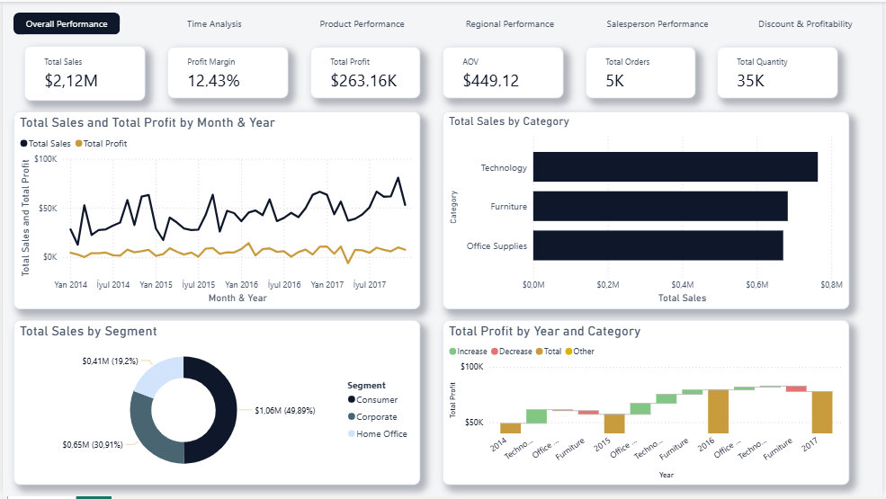

### 9.3 Time Analysis

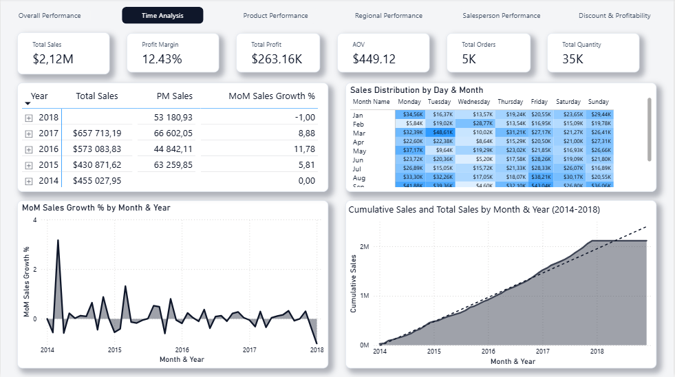

### 9.4 Product Performance

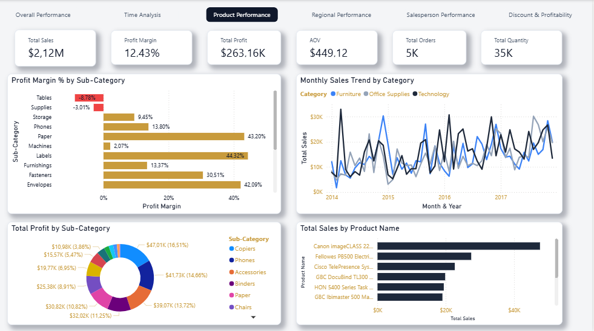

### 9.5 Regional Performance

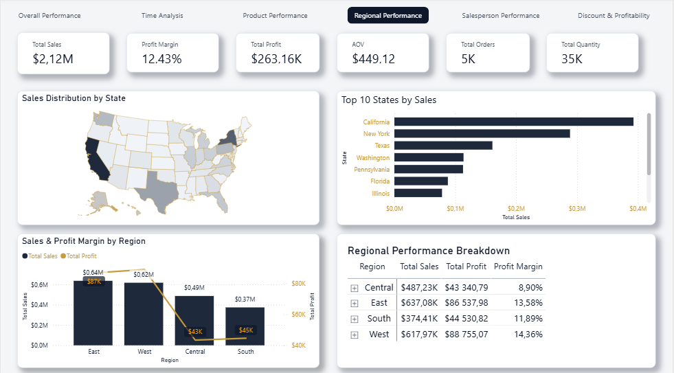

### 9.6 Salesperson Performance

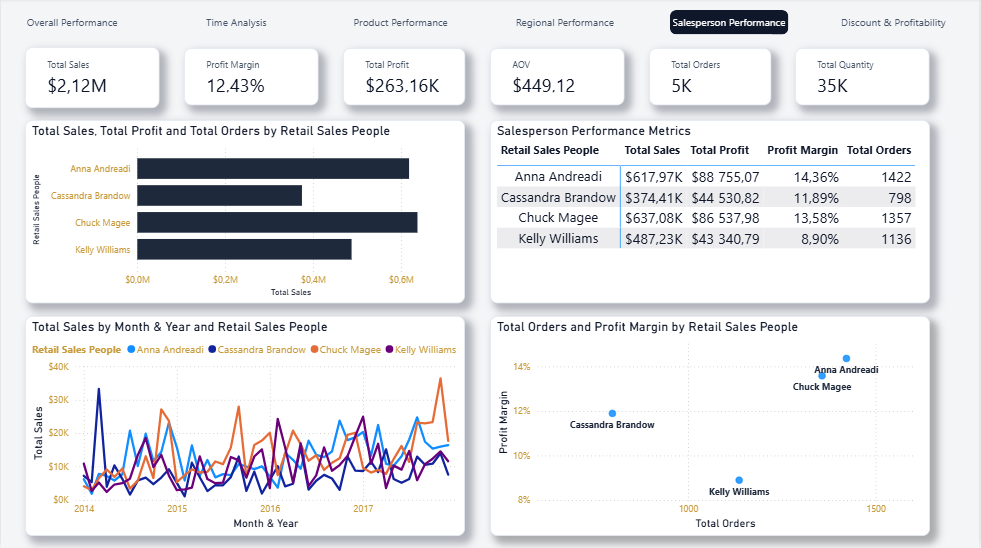

### 9.7 Discount & Profitability

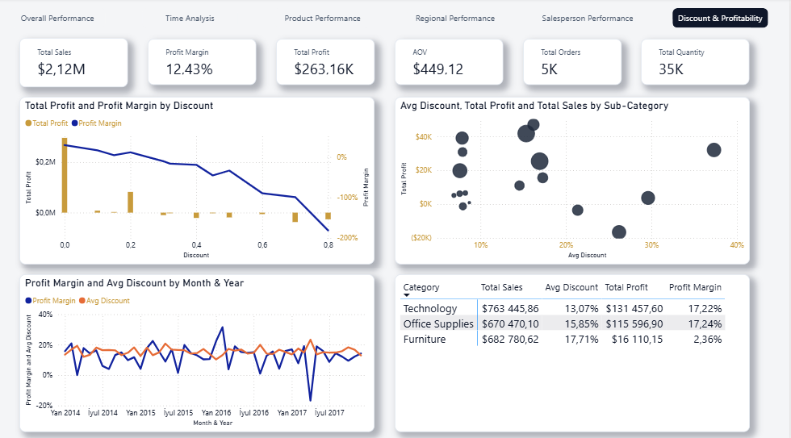

### 9.8 Power BI File

The complete Power BI report is available in the repository:

**[Download Power BI Report](...)**
